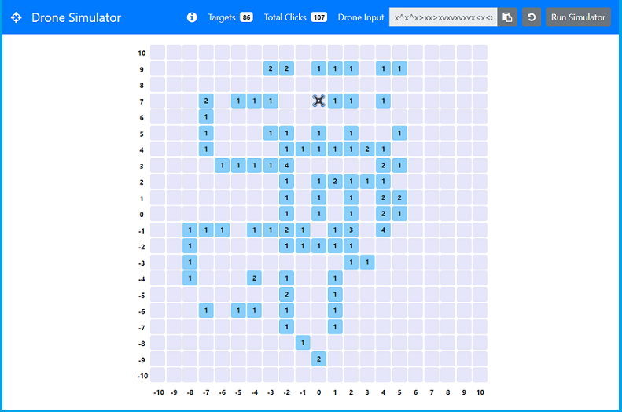
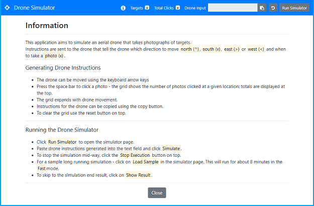
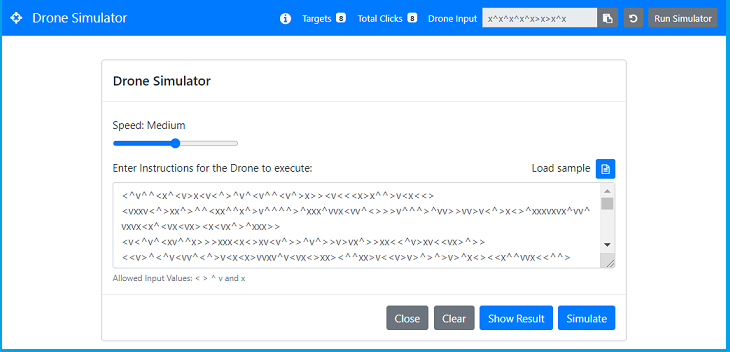

# Drone Simulator

## Description 

  

This application aims to simulate an aerial drone that takes photographs of targets. 
Instructions are sent to the drone that tell the drone which direction to move: north (^), south (v), east (>) or west (<) and when to take a photo (x).

For example: 
`x^xv` takes photos of 2 targets and sends the drone back to the starting position.

To simplify generation of drone instructions, users can use the keyboard arrow keys to move the drone and the space bar to click a photograph. 

Once instructions are generated, users can then run the simulator and copy paste their instructions for the drone to simulate.

For a quick view - you can use the sample data in run simulator to view how the simulation works. 
 

### Deployed Application
[https://gveetil.github.io/React-Drone-Simulator/](https://gveetil.github.io/React-Drone-Simulator/)
 

### The Drone Coding Challenge
The motivation for this application came from the drone coding challenge. 
The original challenge and a backend solution for it can be viewed at:

[https://github.com/Gveetil/Drone-Coding-Challenge](https://github.com/Gveetil/Drone-Coding-Challenge)

## Table of Contents 

- [Technical Features](#technical-features)
- [Usage Guidelines](#usage-guidelines)
  - [Generating Drone Instructions](#generating-drone-instructions)
  - [Running the Drone Simulator](#running-the-drone-simulator)
- [Known Issues](#known-issues)
  

## Technical Features

The Drone Simulator is built purely using React and Bootstrap. Sample data for the application is loaded from a JSON file. The application is currently published as a static site on GitHub Pages.  

## Usage Guidelines

### Generating Drone Instructions
When the Drone Simulator application is loaded, it displays a grid for the drone to move on and a drone at the center: 

  

* To move the drone use the keyboard arrow keys.
* Press the space bar to click a photo - the grid shows the number of photos clicked at a given location.
* The total photos clicked and number of targets photographed are displayed in the top navigation bar.
* The grid expands with drone movements.
* Instructions for the drone are displayed as text in the top navigation bar. This can be copied using the copy button.
* To clear / reset the grid use the reset button in the top navigation bar.
* To view information on how to use this application, click the information icon in the top navigation bar. This will display the below page: 

  

* To run a drone simulation, click on the `Run Simulator` button.
 
  
### Running the Drone Simulator
When the Run Simulator navigation button is clicked, it displays the simulator page: 

  

* Copy and paste the drone instructions generated into the text field. 
* If entering instructions manually, note that the text field only allows the following characters to be input: `< > ^ v and x`
* The drone has 3 execution speeds - slow, medium, and fast.
* Click the `Simulate` button to run the simulation.
* To stop the simulation mid-way, click the `Stop Execution` button in the top navigation bar.
* For a sample long running simulation - click on `Load Sample`. This Simulation will run for about 8 minutes in the `Fast` mode.
* To skip to the simulation end result, click on `Show Result`.
* To clear the form data, click the `Clear` button 
* To return to the main drone homepage, click the `Close` button 

## Known Issues
This application is not fully Responsive and is not mobile friendly. Specifically, the keypress events do not work well in the mobile environment, but the simulator itself and show results should work ok.
